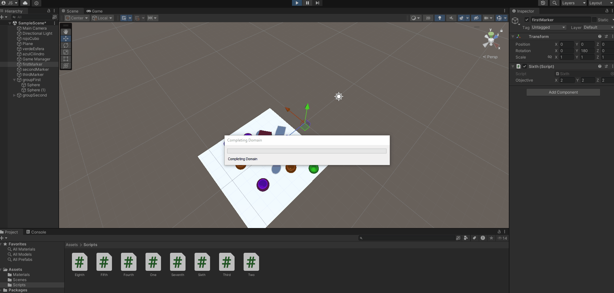

# Práctica 2 de Interfaces Inteligentes: Scripts
## Autor
* Nombre: Juan Rodríguez Suárez
* Correo: alu0101477596@ull.edu.es
## GIFs de los scripts
### Script 1

### Script 2

### Script 3

### Script 4

### Script 5

### Script 6

### Script 7

### Script 8

## Descripción de los scripts
### Script 1
Se crea una propiedad pública para que se pueda modificar desde el inspector de Unity. En el *Update* se calcula un número entero entre 0 y 2 y otro número decimal entre 0 y 1. Posteriormente se cambia el color del material del cubo en función de estos valores. Esto solo se ejecuta cuando *Update* se ha llamado el número de veces que se ha especificado en la propiedad pública (número de frames).
### Script 2
Se crean los objetos y sus respectivos materiales y los arrastramos a la propiedad pública del script (una lista de GameObjects). Luego, en *Start* se recorren los objetos de la lista y se imprime su nombre.
### Script 3
Se crean las dos propiedades públicas *Vector3* y le asignamos valores en el inspector a cada componente. Luego, utilizando los métodos de la clase Vector3 imprimimos los datos pedidos.
### Script 4
Se crea el script asociado a la esfera y sacamos su componente *Transform* con *GetComponent<Transform>()* e imprimimos su propiedad *position*.
### Script 5
Primero en el *Start* recuperamos el cubo y el cilindro con *GameObject.Find* y luego mediante *Vector3.Distance* calculamos la distancia entre el *transform.position* del cubo y ambos objetos.
### Script 6
Se crean tres listas públicas de dos elementos donde se deben arrastrar en primera posición el elemento a mover y en segunda el vector de movimiento. Posteriormente, se crea la misma estructura pero almacenando los *transform* de los objetos. En el *Update*, mediante *Input.GetKeyDown(KeyCode.Space)* se mueve el objeto en la dirección especificada usando *Translate*.
**Importante:** Se mueven en el eje local del objeto, no en el global.
### Script 7
En el *Start* recuperamos tanto el cubo como el cilindro mediante *GameObject.Find* y en el *Update* comprobamos si la tecla *C* o *UpArrow* está pulsada y si es así, cambiamos el color del material del cubo o del cilindro respectivamente mediante una función que recibe una referencia al objeto y le cambia el color a uno aleatorio usando *Random.ColorHSV* con valores fijos para la saturación y el brillo.
### Script 8
Se agregan y agrupan las nuevas esferas y se etiquetan. Luego, en *Start* recuperamos la lista de todas las esferas del grupo 2 con *GameObject.FindGameObjectsWithTag* y las almacenamos en una lista. En el *Update* recorremos la lista buscando la esfera más cercana y la movemos verticalmente con *Translate* con velocidad la que se ha especificado en el inspector. Por último, si la tecla *Space* está pulsada, se cambia el color de la esfera más lejana.